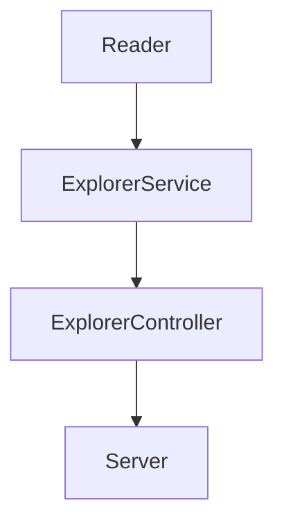

# LaunchX Code challenge

Usando el siguiente [archivo](https://gist.github.com/vicobettik/293b98f37c4b711247dce198b59e7d25) como base de datos simulada, se creó un proyecto de node el cual contiene lo siguiente:

- Módulo de utilería para realizar la lectura de un archivo json y obtener la data con la que se trabajará.
- Servicio para la obtención de información filtrada de los explorers.
- Controlador para implementación de utilería y servicio.
- Pruebas de unidad de cada módulo.
  
  A continuación se muestra un diagrama de la organizacíon del proyecto:

