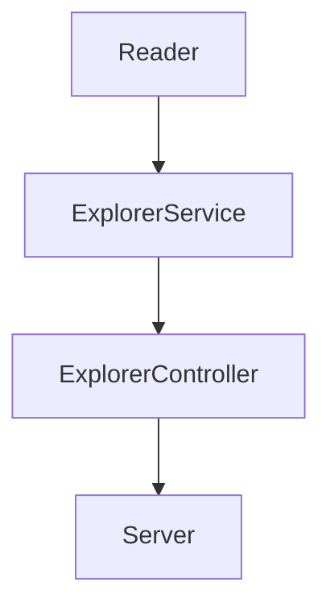

# LaunchX Code challenge

Usando el siguiente [archivo](https://gist.github.com/vicobettik/293b98f37c4b711247dce198b59e7d25) como base de datos simulada, se creó un proyecto de node el cual contiene lo siguiente:

- Módulo de utilería para realizar la lectura de un archivo json y obtener la data con la que se trabajará.
- Servicio para la obtención de información filtrada de los explorers.
- Controlador para implementación de utilería y servicio.
- Pruebas de unidad de cada módulo.
  
  A continuación se muestra un diagrama de la organizacíon del proyecto:



## La api implementada en el proyecto contiene los siguientes endpoints


| Endpoint | Request | Response |
|---|---|---|
|/v1/explorers|localhost:3000/v1/explorers|Se obtienen todos los explorers con todas sus propiedades|
|/v1/explorersCertification|localhost:3000/v1/explorersCertification| Se obtienen los correos de todos los explorers que tengas certificación|
|/v1/explorers/credits|localhost:3000//v1/explorers/credits|Se obtienen los explorers con todas sus propiedades que tengan mas de 500 créditos|

Estos endpoints pueden ser probados usando la [colección](https://gist.github.com/vicobettik/23b8d28679e8604301fab36086c6a400) al exportarla en postman.

Además al ejecutar el comando:

```javascript
npm run server
```

Y dirigirnos en el navegador a la dirección:

``` html
http://localhost:3000/api-docs/
```

Podremos observar la documentación de la api usando [Swagger](https://swagger.io/) 